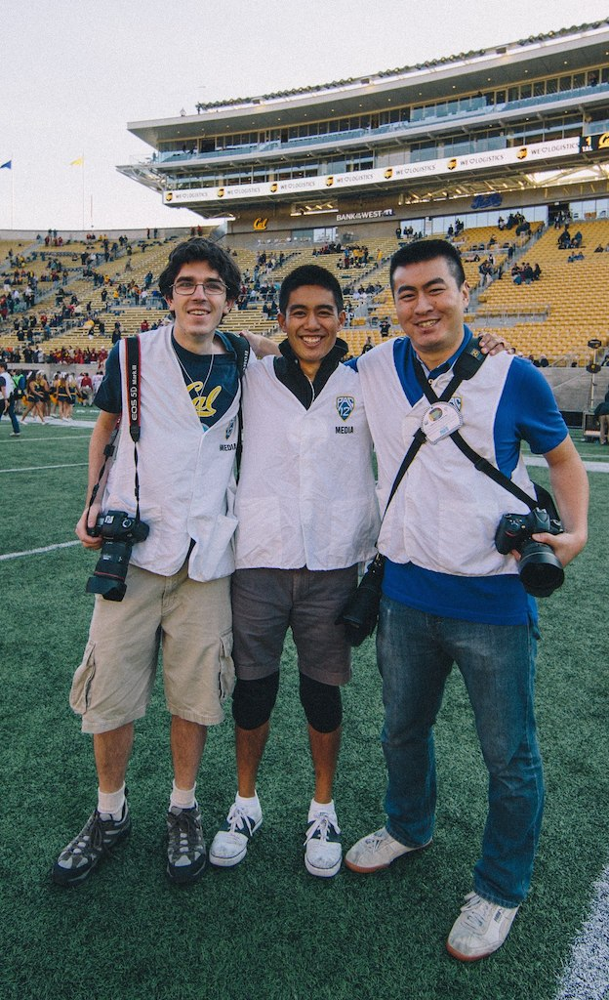

# Welcome! Michael Ball in CS184

_Full disclaimer:_
While I love CS184, this site is really mostly based off of my personal website at [http://michaelballphoto.com](http://michaelballphoto.com). Feel free to poke around there, or the other pages of this site.

The best way to email me, is to use the address: ball@berkeley.edu.
 
(There's no point in obfuscating them as it's super easy to circumvent.)

Anyway, if you're so inclined, you can see an older image of me on my [about page](about). Or you can use this more recent image and figure out who Michael is in the photo! 

P.S. Apologizes that I have yet to (properly) compress my header photo.

## Assignments
You can find pages for all my assignments below.

* [AS0](as0)
* [AS1](as1)
* [AS2](as2)
* [AS3](as3)
* [AS4](as4)

